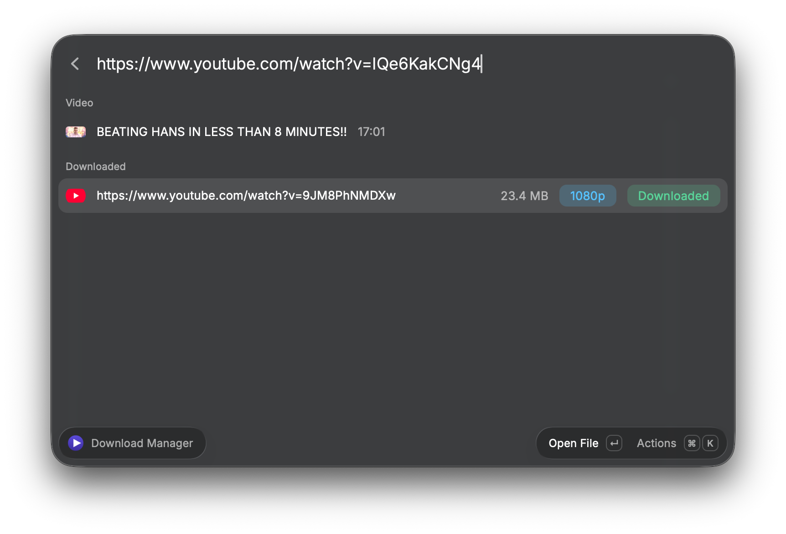
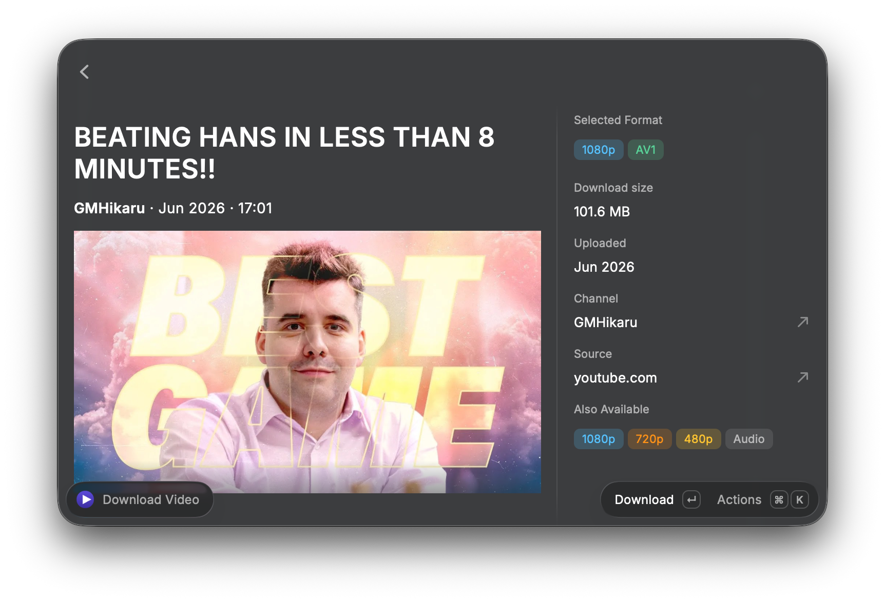
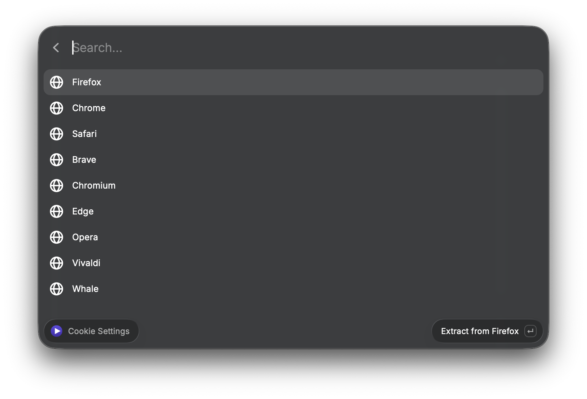

# Smart Video Downloader V2

A Raycast extension that wraps [yt-dlp](https://github.com/yt-dlp/yt-dlp) with a native UI, persistent download state, and full background execution. Downloads survive Raycast — and your terminal — closing.

Supports YouTube, Vimeo, Twitter/X, TikTok, Instagram, and 1000+ other sites.

## Why this one

Most yt-dlp wrappers on Raycast need the separate Raycast Browser Extension installed before they can see what tab you're on, and none of them give you a true one-keystroke download.

- **No Browser Extension required.** Active-tab detection uses a native macOS Automation script (JXA), not the Raycast Browser Extension. One less thing to install, one less permission prompt to manage.
- **Quick Download.** Bind a global hotkey and download whatever video is in your active browser tab instantly — no window opens, no format picker, just a HUD confirmation.
- **Cookie-aware by default.** Extract cookies from any installed browser to pull age-restricted, members-only, or sign-in-gated content, with one-key re-extraction (⌘⇧K) the moment a cookie goes stale.
- **Smart filenames.** Optional channel-name prefixing and ID suffixing keep large download folders sorted and collision-free.

## Screenshots

### Download Manager
Paste a URL, pick a format, and track every download — in progress or completed.

### Download Video
Detects the video playing in your active browser tab, previews its metadata, and lets you pick a specific quality or codec before downloading.

### Cookie Settings
Extract cookies from your browser to download age-restricted, members-only, or sign-in-protected content.

## Commands

| Command | Mode | Purpose |
|---|---|---|
| **Download Manager** | view | Primary interface — paste a URL, pick a format, track all downloads |
| **Download Video** | view | Browser integration — detect the active tab's video, preview metadata, download |
| **Quick Download** | no-view | Instant global hotkey — download the active browser tab's video headlessly |
| **Cookie Settings** | view | Manage browser cookies for protected content |

## Requirements

- [yt-dlp](https://github.com/yt-dlp/yt-dlp) and [ffmpeg](https://ffmpeg.org/) (the extension can install both via Homebrew if missing)
- macOS, with Raycast's Automation permission granted on first use (needed to read the active browser tab's URL — no separate extension install required)

## Preferences

- Download folder (default `~/Downloads`)
- Preferred video codec (AV1 / VP9 / HEVC / H.264 / Best)
- Max quality (up to 4K)
- Group downloads by channel name
- Append video ID to filenames
- Force IPv4 (helps on networks with broken IPv6)
